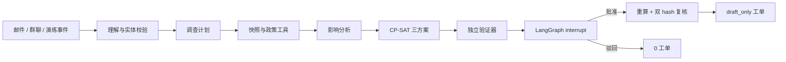

# 有界｜制造供应链异常研判与恢复计划智能体

**能力有界，方案可证，决策在人。**

- GitHub 源码：<https://github.com/RexKing6/youjie-agent>
- 复赛 PPT / PDF：[`docs/youjie_goai_semifinal_pitch_8slides.pptx`](docs/youjie_goai_semifinal_pitch_8slides.pptx) / [`docs/youjie_goai_semifinal_pitch_8slides.pdf`](docs/youjie_goai_semifinal_pitch_8slides.pdf)
- 真实操作视频：[`docs/youjie_semifinal_demo.mp4`](docs/youjie_semifinal_demo.mp4)

有界面向制造计划员，把供应商邮件、群聊或演练告警变成可追溯事故，使用 LangGraph 规划和执行受限工具链，再由 OR-Tools CP-SAT 与独立验证器生成三种恢复方案。图会在人工审批处真实暂停；只有场景哈希、计划哈希和验证证据仍一致，才生成 `draft_only` 工单。

这不是要替代 ERP/MES，也不控制设备。LLM 负责理解不可信文本；LangGraph 负责状态、路由、中断与恢复；确定性代码负责 BOM、库存、产能、求解、验证和权限门禁。复赛版包含三类不会混称的集成证据：真实本机 ERPNext v16 测试实例创建并回读 Material Request / Work Order 草稿；真实本机 OpenMES 测试实例接收同号工单并回读生产状态；项目自有合同沙箱验证商业 ERP/MES 的异步回调、部分失败和重排语义。它们都不是生产厂商认证接入。

## 主案例不是“参考公开数据”

主案例实际包含 Mendeley Data 的原始 `.xlsb` 文件：[Optimisation model for multi-item multi-echelon supply chains with nested multi-level products](https://data.mendeley.com/datasets/pr3sdy5vp3/1)，DOI `10.17632/pr3sdy5vp3.1`，许可 CC BY 4.0。

- 原文件 SHA-256：`1ea0bcdea3225d308be913c9ca0f377585e1863847c78d6e8eec10b6de82889e`。
- 从 `demands` 第 61 期选取三个重复 BOM 配置，共 217 条逐车需求行。
- 聚合订单数量仍为 217，数量守恒差为 0。
- BOM、需求、库存、提前期、供应弧容量和整车产能保留工作表行号；详见 `data/cases/mendeley_drill/lineage.json`。
- 客户名称、优先级、事故邮件、应急供应商、价格、恢复预算和审批记录是明确分层的 synthetic overlay。

该公开数据是行业背景随机化数据，不是某家企业的原始生产流水。本项目不包含任何阿里云内部代码或数据。

## LangGraph 闭环



节点实现位于 `src/delivery_guard/graph.py`。默认使用 `InMemorySaver` 保存演练线程；生产化必须换成持久 checkpointer 和 RBAC。

主事故为模拟的 Q2J 座椅供应延迟 48 小时。三个方案使用相同硬约束，实际结果为：

| 方案 | 首个交期按时 | 未按时 | 应急采购 | 恢复成本 | 验证 |
|---|---:|---:|---:|---:|---|
| 保交付 | 91 / 217 | 126 | 91 | ¥728 | 通过 |
| 平衡 | 45 / 217 | 172 | 45 | ¥360 | 通过 |
| 少变更 | 0 / 217 | 217 | 0 | ¥0 | 通过 |

## 复赛四类一键验证

| 案例 | 系统必须做对的事 | 可见结果 |
|---|---|---|
| 正常恢复 | 生成三种可验证方案并进入人审 | `awaiting_approval`；批准后 4 张新增 `draft_only` 动作，既有 committed 供应只引用不重复建单 |
| 来源冲突 | 不得在 48h 与 72h 之间静默择值 | `needs_clarification`；人工确认后恢复图 |
| 全局无解 | 不得为 400 台/24h 虚构排程 | 最大 305 台、缺口 95 台、工单 0 |
| 提示注入 | 隔离“绕过审批/关闭验证器”，只保留有 span 的业务事实 | `prompt_injection` 标记；驳回后工单 0 |

来源冲突案例同时使用 PNG 邮件截图、PDF 承运通知和 MES CSV。`evidence/manifest.json` 记录 SHA-256、媒体类型、观察时间、抽取方式、页码/bbox/行列位置和新鲜度；两个新鲜来源不一致时，LangGraph 在求解前真实暂停。

## 复赛版：方案可视化与 ERP/MES 回流

“恢复驾驶舱”在同一页面展示 supplier→material→product→order→line 影响图、三方案 KPI 和同轴甘特图。系统集成分为三条可区分的证据链：

- **真实 ERPNext 测试实例**：认证 REST、真实主数据、1 张应急 Material Request + 3 张 Work Order 草稿创建、既有 217 件 committed 供应只引用、立即 GET 回读、源 revision 变化和幂等重试；证据见 `artifacts/erpnext_real_validation.json`。
- **真实 OpenMES 测试实例**：固定上游 commit `f0ccdd1c7a57804212ed337d340aebfeebacc372`；使用官方 `/api/v1/erp/work-orders/import` 接收 3 张 ERPNext 同号工单，再按状态读取 `/api/v1/erp/production/completions`。只允许工单导入和生产/质量回读，设备命令全部拒绝。
- **独立 ERP/MES 合同沙箱**：真实 localhost HTTP/JSON 与 SQLite outbox/inbox，用来验证厂商授权前仍可复算的协议和失败语义。

合同沙箱链路为：

1. 分别读取 ERP 订单/BOM/库存/供应承诺和 MES 产线/工艺快照，保留 revision/hash；
2. 人工批准后才创建绑定 scenario/plan/approval hash 的 ERP/MES 草稿命令；
3. HTTP 202 后业务状态仍为 `PENDING`；
4. ERP 回调 `APPLIED`，MES 因产能版本冲突回调 `REJECTED`，整体显示 `PARTIALLY_APPLIED`；
5. MES 新产能事实使旧批准失效，系统重新求解并回到人审，新工单保持 0。

真实开源链路包含 `erpnext_open_source_test_profile` 与 `openmes_open_source_test_profile`；商业系统仍由 `sap_s4_dm_contract_profile`、`kingdee_blacklake_contract_profile` 两个合同沙箱覆盖。ERPNext/OpenMES 都是本机测试实例而非生产租户；后两者只是项目自有 canonical contract 的 adapter 映射，不代表通过 SAP、金蝶或黑湖认证。映射位于 `data/integrations/erpnext_demo_mapping.json` 与 `openmes_demo_mapping.json`；通用接口、schema、示例和字段映射位于 `contracts/`。

## 随机事故演练 Agent

`ChaosDrillAgent` 根据 seed 生成五类合法事故：供应延期、供应中断、库存损失、产线停机、需求激增。它先从场景中的真实 ID 和有效取值范围采样，再交给同一 LangGraph/solver/verifier/人审链路。

它无权求解、批准、写回或控制设备。相同 seed 产生完全相同事件；`seed % 5` 保证连续五个 seed 覆盖五类事故。

## 运行

```bash
python3.12 -m venv .venv
.venv/bin/python -m pip install -r requirements-dev.txt
.venv/bin/python scripts/build_mendeley_case.py
.venv/bin/python -m pytest -q
.venv/bin/streamlit run app.py --server.headless true
```

产品演示网页的真实运行 API（只监听本机；密钥保留在服务端）：

```bash
.venv/bin/python -m delivery_guard.demo_api --port 8765
```

另开终端运行提交 ZIP 内的产品演示网页：

```bash
cd frontend/site
npm ci
npm run dev
```

浏览器打开 `http://localhost:3000/`。真实 ERPNext / OpenMES 连接需要部署者在后端通过私有凭证文件配置；凭证不进入网页、日志或提交包。

网页调用 `POST /api/v1/agent/run` 运行真实模型和 LangGraph，调用
`POST /api/v1/agent/approve` 恢复人审中断，再调用
`POST /api/v1/integration/run` 执行 localhost ERP/MES 合同沙箱链路；
`POST /api/v1/integration/erpnext/run` 执行真实 ERPNext 测试实例的草稿写入与回读；
`POST /api/v1/integration/erpnext/feedback` 重新读取 Work Order / Job Card / Material Request revision；
`POST /api/v1/integration/openmes/run` 把本次 ERPNext 工单下发到真实 OpenMES；
`POST /api/v1/integration/openmes/feedback` 重新读取 MES 状态、产量与完成时间。
`GET /api/v1/contracts`、`/contracts/openapi.yaml` 与
`/contracts/asyncapi.yaml` 提供可直接检查的协议入口。API 不接受浏览器传入的
模型地址或密钥，也不会把服务端凭证返回浏览器。

固定邮件的可复现 LangGraph 证据：

```bash
.venv/bin/python -m delivery_guard.cli run-graph \
  --case-dir data/cases/mendeley_drill \
  --replay data/model_replays/mendeley_drill.json \
  --profile balanced \
  --output artifacts/public_data_graph_run.json
```

随机事故演练：

```bash
.venv/bin/python -m delivery_guard.cli run-drill \
  --case-dir data/cases/mendeley_drill \
  --replay data/model_replays/mendeley_drill.json \
  --seed 20260810 \
  --profile balanced \
  --output artifacts/chaos_drill_run.json
```

Replay 是公开、固定的结构化响应夹具，不冒充现场模型调用。Live OpenAI-compatible 模式只从运行时环境变量读取 endpoint、model 和 key；本地复赛版已用 `qwen3.8-max` 实测，提交 ZIP 不含 `.streamlit/secrets.toml`。无密钥环境仍可完整运行 Replay。

真实模型黄金集复算（会产生 90 次 API 调用）：

```bash
PYTHONPATH=src .venv/bin/python scripts/run_live_model_evaluation.py \
  --runs 3 --output artifacts/live_agent_eval_report.json
```

最终 3 轮均为 `30/30`，禁止工具调用均为 `0`，平均/p95 延迟为 `2.14s/2.69s`。原始模型意图、实体 ID、业务字段、安全标记准确率分别为 `88.9%/40.0%/95.6%/100%`；经确定性实体解析、完整性检查和工具权限策略后，有界 Agent 合同通过率为 `100%`。这只证明该模型、提示词、endpoint、时间点和 30 条合成黄金集上的表现，不外推为生产准确率。

运行复赛三系统对比：

```bash
PYTHONPATH=src .venv/bin/python scripts/run_semifinal_comparison.py
```

比较对象是仓库内三个冻结参考实现，不代表外部产品或通用大模型。12 个案例逐项检查决策、越权动作、证据追溯、独立验证、人审门和安全标记；当前结果为 `0/12`、`2/12`、`12/12`，三个系统重复运行两次均完全一致。

真实 ERPNext 验证需要部署者提供一个不进入仓库的私有凭证文件：

```bash
PYTHONPATH=src .venv/bin/python scripts/validate_erpnext_real.py \
  --credential-file /absolute/path/to/erpnext_credentials.json \
  --ledger /absolute/path/to/erpnext_validation.sqlite3
```

适配器只接受 `test` / `sandbox`，远程 HTTP 会被拒绝；允许创建的 doctype 只有 Material Request 与 Work Order，且强制 `docstatus=0`。submit、cancel、delete、任意 RPC 与设备控制均不在接口面内。

## 验证基线

- 67 个自动化测试通过。
- Mendeley 文件 hash、原始行号、217→217 数量守恒均自动检查。
- 固定邮件图在真实 LangGraph interrupt 处暂停，批准后生成 4 张新增草稿动作；既有 committed 供应不会重复生成采购申请。
- 五类随机事故均能通过领域校验并作用于隔离的场景副本。
- 旧的 15/15 求解/状态机对抗套件和 30/30 replay 合同继续作为回归证据；后者不是 live 模型准确率。
- `qwen3.8-max` 在相同 30 条黄金集上独立复跑 3 次均为 30/30；90 次禁止工具调用为 0，原始模型与规则约束后指标分开报告。
- 12 个复赛安全路由案例的可执行三系统对比通过，完整逐项结果位于 `artifacts/semifinal_comparison_report.json`。
- 真实 ERPNext REST 创建并回读 4 张新增草稿；既有 committed 供应只引用；写前/写后 revision 不同；重复执行新增 0 张；凭证未进入证据文件。

完整验证：

```bash
.venv/bin/python -m pytest -q
.venv/bin/python -m delivery_guard.cli run --scenario data/demo_factory.json --incident data/incidents/supplier_delay.json --output artifacts/demo_run.json
.venv/bin/python -m delivery_guard.cli evaluate --scenario data/demo_factory.json --suite data/adversarial_suite.json --output artifacts/adversarial_report.json
.venv/bin/python scripts/build_mendeley_case.py
.venv/bin/python -m delivery_guard.cli run-graph --case-dir data/cases/mendeley_drill --replay data/model_replays/mendeley_drill.json --output artifacts/public_data_graph_run.json
.venv/bin/python -m delivery_guard.cli run-drill --case-dir data/cases/mendeley_drill --replay data/model_replays/mendeley_drill.json --seed 20260810 --output artifacts/chaos_drill_run.json
.venv/bin/python scripts/run_semifinal_comparison.py
.venv/bin/python scripts/run_live_semifinal_validation.py
PYTHONPATH=src .venv/bin/python scripts/run_integration_validation.py --runs 10
PYTHONPATH=src .venv/bin/python scripts/validate_erpnext_real.py --credential-file /absolute/path/to/erpnext_credentials.json --ledger /absolute/path/to/erpnext_validation.sqlite3
PYTHONPATH=src .venv/bin/python scripts/export_integration_contracts.py
PYTHONPATH=src .venv/bin/python scripts/run_live_model_evaluation.py --runs 3 --output artifacts/live_agent_eval_report.json
.venv/bin/python scripts/verify_artifacts.py
.venv/bin/python -m compileall -q src app.py scripts tests
```

## 复赛交付物

- `docs/youjie_goai_semifinal_pitch_8slides.pptx`：8 页、16:9、可编辑复赛 PPT；只保留事故、闭环、数据、三方案、产品、ERP/MES 与边界主线。
- `docs/youjie_goai_semifinal_pitch_8slides.pdf`：与最终渲染逐页一致的 8 页高保真 PDF。
- `docs/youjie_semifinal_demo.mp4`：2 分 02 秒真实网页操作视频，190 语速，H.264/AAC、1280×720，已烧录中文字幕；独立字幕文件为 `docs/youjie_semifinal_demo.zh-CN.srt`。
- `docs/submission.md`：复赛提交说明；`docs/demo_script.md`：5 分钟现场演示脚本。
- `docs/semifinal_feedback_verification.md`：评审意见和复赛规则逐项反审；`docs/defense_runbook.md` / `defense_evidence_index.md`：答辩与故障切换材料。
- `artifacts/semifinal_comparison_report.json`：三系统逐案例评分；`artifacts/live_agent_eval_report.json`：90 次真实模型调用及原始/有界双层指标。
- `artifacts/integration_validation_report.json`：四种集成 profile 各 10 次完整 HTTP 链路、当前共 72/72 对抗检查；真实 ERPNext/OpenMES 实例验证另列。
- `artifacts/openmes_real_validation.json`：本机 ERPNext→OpenMES 同号工单导入、回读、幂等与人工状态变化后旧审批失效的无密钥证据。
- `artifacts/erpnext_real_validation.json`：真实 ERPNext 测试实例认证、4 张新增草稿写入/回读、既有供应引用、revision 与幂等边界证据。
- `contracts/`：OpenAPI、AsyncAPI、四份 JSON Schema、两个完整交互样例和厂商映射边界。
- `artifacts/youjie_semifinal_submission.zip`：评审可直接解压运行的最终附件包。
- `frontend/site/`（位于提交 ZIP 内）：产品化 Next/Vinext 演示网页源码；不含 `node_modules`、构建缓存或密钥。

## 目录

- `data/public/mendeley_automotive/`：经 hash 核验的 CC BY 4.0 原工作簿。
- `data/cases/mendeley_drill/`：公开行派生场景、逐行 lineage、模拟事故与政策。
- `src/delivery_guard/mendeley.py`：可复现抽取与数量守恒。
- `src/delivery_guard/graph.py`：LangGraph 状态图与人审 interrupt。
- `src/delivery_guard/chaos_agent.py`：有边界、可复现的随机事故生成器。
- `src/delivery_guard/solver.py` / `verifier.py`：求解和独立验证。
- `artifacts/public_data_graph_run.json` / `chaos_drill_run.json`：机器可读运行证据。

代码使用 Apache-2.0；Mendeley 原数据及派生行遵守 CC BY 4.0，第三方依赖保持各自许可证。
