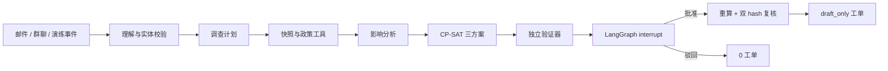

# 有界｜制造供应链异常研判与恢复计划智能体

**能力有界，方案可证，决策在人。**

- 在线 Demo：<https://youjie-goai-2026.streamlit.app/>
- GitHub 源码：<https://github.com/RexKing6/youjie-agent>
- 主演示视频：[`docs/youjie_demo.mp4`](docs/youjie_demo.mp4)

有界面向制造计划员，把供应商邮件、群聊或演练告警变成可追溯事故，使用 LangGraph 规划和执行受限工具链，再由 OR-Tools CP-SAT 与独立验证器生成三种恢复方案。图会在人工审批处真实暂停；只有场景哈希、计划哈希和验证证据仍一致，才生成 `draft_only` 工单。

这不是 ERP/MES，也不控制设备。LLM 负责理解不可信文本；LangGraph 负责状态、路由、中断与恢复；确定性代码负责 BOM、库存、产能、求解、验证和权限门禁。

## 主案例不是“参考公开数据”

主案例实际包含 Mendeley Data 的原始 `.xlsb` 文件：[Optimisation model for multi-item multi-echelon supply chains with nested multi-level products](https://data.mendeley.com/datasets/pr3sdy5vp3/1)，DOI `10.17632/pr3sdy5vp3.1`，许可 CC BY 4.0。

- 原文件 SHA-256：`1ea0bcdea3225d308be913c9ca0f377585e1863847c78d6e8eec10b6de82889e`。
- 从 `demands` 第 61 期选取三个重复 BOM 配置，共 217 条逐车需求行。
- 聚合订单数量仍为 217，数量守恒差为 0。
- BOM、需求、库存、提前期、供应弧容量和整车产能保留工作表行号；详见 `data/cases/mendeley_drill/lineage.json`。
- 客户名称、优先级、事故邮件、应急供应商、价格、恢复预算和审批记录是明确分层的 synthetic overlay。

该公开数据是行业背景随机化数据，不是某家企业的原始生产流水。本项目不包含任何阿里云内部代码或数据。

## LangGraph 闭环



节点实现位于 `src/delivery_guard/graph.py`。默认使用 `InMemorySaver` 保存演练线程；生产化必须换成持久 checkpointer 和 RBAC。

主事故为模拟的 Q2J 座椅供应延迟 48 小时。三个方案使用相同硬约束，实际结果为：

| 方案 | 首个交期按时 | 未按时 | 应急采购 | 恢复成本 | 验证 |
|---|---:|---:|---:|---:|---|
| 保交付 | 91 / 217 | 126 | 91 | ¥728 | 通过 |
| 平衡 | 45 / 217 | 172 | 45 | ¥360 | 通过 |
| 少变更 | 0 / 217 | 217 | 0 | ¥0 | 通过 |

## 随机事故演练 Agent

`ChaosDrillAgent` 根据 seed 生成五类合法事故：供应延期、供应中断、库存损失、产线停机、需求激增。它先从场景中的真实 ID 和有效取值范围采样，再交给同一 LangGraph/solver/verifier/人审链路。

它无权求解、批准、写回或控制设备。相同 seed 产生完全相同事件；`seed % 5` 保证连续五个 seed 覆盖五类事故。

## 运行

```bash
python -m venv .venv
.venv/bin/python -m pip install -e '.[dev]'
.venv/bin/python scripts/build_mendeley_case.py
.venv/bin/python -m pytest -q
.venv/bin/streamlit run app.py --server.headless true
```

固定邮件的可复现 LangGraph 证据：

```bash
.venv/bin/python -m delivery_guard.cli run-graph \
  --case-dir data/cases/mendeley_drill \
  --replay data/model_replays/mendeley_drill.json \
  --profile balanced \
  --output artifacts/public_data_graph_run.json
```

随机事故演练：

```bash
.venv/bin/python -m delivery_guard.cli run-drill \
  --case-dir data/cases/mendeley_drill \
  --replay data/model_replays/mendeley_drill.json \
  --seed 20260810 \
  --profile balanced \
  --output artifacts/chaos_drill_run.json
```

Replay 是公开、固定的结构化响应夹具，不冒充现场模型调用。Live OpenAI-compatible 模式只从运行时环境变量读取 endpoint、model 和 key。
公开部署未配置模型密钥，因此界面只开放 Replay；需要 Live 时由部署者在 Streamlit Secrets 中配置，页面不采集密钥。

## 验证基线

- 32 个自动化测试通过。
- Mendeley 文件 hash、原始行号、217→217 数量守恒均自动检查。
- 固定邮件图在真实 LangGraph interrupt 处暂停，批准后生成 5 张草稿工单。
- 五类随机事故均能通过领域校验并作用于隔离的场景副本。
- 旧的 15/15 求解/状态机对抗套件和 30/30 replay 合同继续作为回归证据；后者不是 live 模型准确率。

完整验证：

```bash
.venv/bin/python -m pytest -q
.venv/bin/python -m delivery_guard.cli run --scenario data/demo_factory.json --incident data/incidents/supplier_delay.json --output artifacts/demo_run.json
.venv/bin/python -m delivery_guard.cli evaluate --scenario data/demo_factory.json --suite data/adversarial_suite.json --output artifacts/adversarial_report.json
.venv/bin/python scripts/build_mendeley_case.py
.venv/bin/python -m delivery_guard.cli run-graph --case-dir data/cases/mendeley_drill --replay data/model_replays/mendeley_drill.json --output artifacts/public_data_graph_run.json
.venv/bin/python -m delivery_guard.cli run-drill --case-dir data/cases/mendeley_drill --replay data/model_replays/mendeley_drill.json --seed 20260810 --output artifacts/chaos_drill_run.json
.venv/bin/python scripts/verify_artifacts.py
.venv/bin/python -m compileall -q src app.py scripts tests
```

## 答辩交付物

- `docs/youjie_goai_pitch.pptx`：11 页、16:9、可编辑答辩 PPT，含逐页讲稿。
- `docs/youjie_demo.mp4`：64 秒真实 Web 操作视频，完整展示固定邮件、LangGraph 中断、三方案、人工批准、`draft_only` 工单、工具审计和随机事故 Agent；含中文讲解，H.264/AAC、1280×720。
- `docs/youjie_pitch_overview.mp4`：2 分 22 秒答辩概览版，主要用于快速讲解 PPT 逻辑，不作为主 Demo。
- `docs/submission.md`：可直接粘贴到初赛表单的作品文案。
- `docs/demo_script.md`：5 分钟现场演示脚本。
- `artifacts/`：运行日志、对抗报告和 Agent 回归证据。

## 目录

- `data/public/mendeley_automotive/`：经 hash 核验的 CC BY 4.0 原工作簿。
- `data/cases/mendeley_drill/`：公开行派生场景、逐行 lineage、模拟事故与政策。
- `src/delivery_guard/mendeley.py`：可复现抽取与数量守恒。
- `src/delivery_guard/graph.py`：LangGraph 状态图与人审 interrupt。
- `src/delivery_guard/chaos_agent.py`：有边界、可复现的随机事故生成器。
- `src/delivery_guard/solver.py` / `verifier.py`：求解和独立验证。
- `artifacts/public_data_graph_run.json` / `chaos_drill_run.json`：机器可读运行证据。

代码使用 Apache-2.0；Mendeley 原数据及派生行遵守 CC BY 4.0，第三方依赖保持各自许可证。
