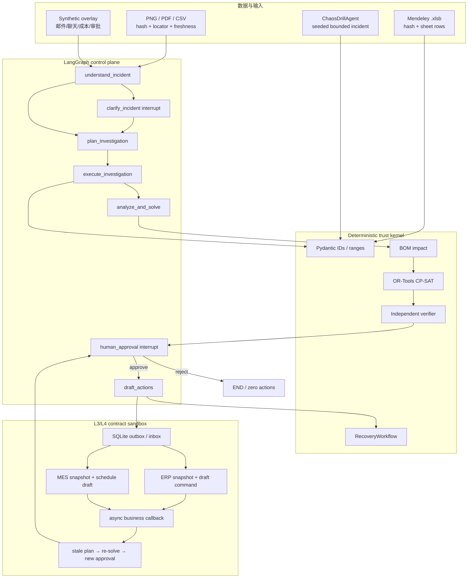

# LangGraph 架构与可信边界

## 架构结论

有界是一个 LangGraph 单 Agent 控制面和确定性可信内核。没有用多个人设 Agent 包装同一模型；随机事故 Agent 是独立的演练输入生成器，不参与求解或审批。

## 图节点

| 节点 | 职责 | LLM 权限 |
|---|---|---|
| `understand_incident` | 邮件转 `IncidentDraft`，或校验演练 ground truth | 只能提出候选字段与 source span |
| `clarify_incident` | 缺失、冲突或确认项触发动态 interrupt | 无求解和执行权限 |
| `plan_investigation` | 按事故类型选择 allowlisted 查询、检索、分析、求解动作 | 不能创建新工具名 |
| `execute_investigation` | 冻结快照、检索政策并记录引用 | 文档是数据，不能改权限 |
| `analyze_and_solve` | 调用影响引擎、三策略 CP-SAT、独立 verifier | LLM 不参与数值计算 |
| `human_approval` | LangGraph checkpoint + interrupt，等待批准或驳回 | 只有人能作决定 |
| `draft_actions` | 从原场景重算，核对 scenario/plan hash，再生成草稿 | 不能执行外部写回 |

`understand_incident` 在求解前额外检查证据 hash、新鲜度和字段冲突。两个新鲜来源对同一字段给出不同值时，状态只允许进入 `clarify_incident`；过期来源会被展示，但不能替代人工选择权威新鲜来源。

图使用 `InMemorySaver` 和稳定 `thread_id` 演示暂停/恢复。生产化需要 SQLite/Postgres 等持久 checkpointer、加密、RBAC 和多实例幂等。

## 为什么批准后再求解一次

LangGraph interrupt 期间外部事实可能变化。恢复后系统不直接相信审批前的内存对象，而是：

1. 从原 Scenario 和 Incident 重建 `RecoveryWorkflow`；
2. 重新运行影响分析、CP-SAT 和 verifier；
3. 比较新的 `scenario_hash` 与审批看到的 hash；
4. 比较候选 `plan_hash` 与审批看到的 hash；
5. 两者一致才创建审批记录和 `draft_only` 工单。

这使“旧页面批准”“篡改候选 JSON”和“断点后场景变化”无法静默越权。

## 求解硬约束

- 工序产线资格、时间窗、release、前置关系和资源互斥；
- 供应来源容量、禁用状态、承诺下限和到货时间；
- BOM 展开后的逐事件库存守恒；
- critical/frozen 订单不得静默放弃；
- 恢复预算上限；
- 所有计划必须由独立 verifier 从输出 JSON 重放。

三个 profile 只改变服务、延迟、恢复成本和动作数量权重/预算，不改变硬约束。

## 随机事故 Agent

`ChaosDrillAgent` 从已验证场景实体采样，支持：

- supplier delay / shutdown；
- inventory loss（不超过可用库存）；
- line outage（窗口在 horizon 内）；
- demand surge（目标必须是已存在订单）。

它输出结构化 Incident 和模拟邮件/聊天/MES 文案。文字仍是不可信展示数据；实际变更只来自通过 Pydantic 的 Incident。相同 seed 完全复现。

## ERP/MES 回流边界

集成分成三个不会混称的层次：

1. `erpnext_open_source_test_profile` 连接真实本机 ERPNext v16 开源测试实例。适配器通过 token-auth REST 读取 BOM、库存、Work Order、Job Card、Material Request，仅创建 Material Request / Work Order 草稿并立即 GET 回读；SQLite ledger 提供幂等和部分失败后的人工复核锁。它不是生产租户，也不把 ERPNext 的制造模块冒充独立 MES。
2. `openmes_open_source_test_profile` 连接真实本机 OpenMES 测试实例，固定上游 commit `f0ccdd1c7a57804212ed337d340aebfeebacc372`。ERPNext Work Order 名称成为跨系统 `order_no`；OpenMES 官方 ERP API 接收批准后的工单，并按状态回读 `produced_qty/status/updated_at`。适配器不暴露任何产线启停、机器命令或 OT 写入路径。
3. 项目自建 localhost HTTP/JSON + SQLite outbox/inbox 合同沙箱。两个 profile 分别模拟 SAP S/4HANA + SAP Digital Manufacturing，以及金蝶云星空 + 黑湖智造的典型集成形态；它们共享 canonical contract，均明确标为 `NON-CERTIFIED · NO LIVE TENANT`。

命令只允许由有效人工批准、scenario hash 和 plan hash 共同生成。HTTP 202 只把 outbox 状态推进到已发送，业务状态仍为 `PENDING`；只有 callback 或主动查询才能变为 `APPLIED/REJECTED/...`。MES 回流的产能 revision 若改变计划依赖，旧批准立即失效，重新求解后回到人审，不能继续复用旧工单。设备控制类 command 在 Pydantic 合同边界直接拒绝。

## 生产化缺口

- 持久 checkpointer、审批 RBAC、双人复核、审计签名；
- 已有真实本机 ERPNext REST 草稿写入/回读、真实 OpenMES 工单导入/生产状态回读、HTTP 合同沙箱、SQLite outbox/inbox、幂等与部分失败演练；仍缺生产 tenant 的 RBAC/OAuth、分页/限流、网络隔离、持久消息基础设施、补偿审批和厂商验收；
- 多工厂、多仓、在途、替代料、setup、人员技能和分时供应容量；
- 授权脱敏历史事故回放与真实人工基线；
- 已完成 `qwen3.8-max` 3×30 合成黄金集评测；仍需授权脱敏历史事故、人工基线和模型升级回归，不能把该分数外推为生产准确率。
